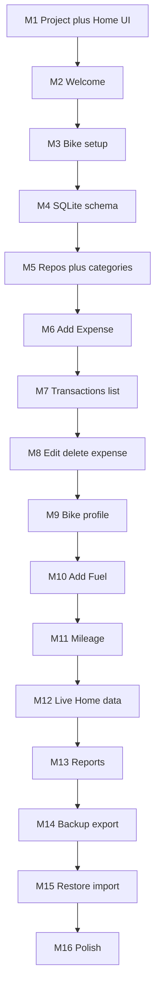

# RideWise milestones

**This file is the single source of truth for delivery status.** Both developers and agents must read and update it. Product requirements live in [ProjectBlueprint.md](ProjectBlueprint.md). Do not treat Cursor Plan-mode files (outside this repo) as canonical.

## How we work

1. Pull `main` before starting.
2. Claim work in **Current work** below (your name + branch) in the same PR as the feature — or a tiny PR first if you need to lock it.
3. Only **one** mobile milestone is `In progress` at a time unless both of you agree otherwise in this file.
4. Do not start the next milestone until the current one is `Done`.
5. Status values: `Done` | `In progress` | `Next` | `Pending`.
6. When a milestone is finished: set it to `Done`, move `Next` to the following row, clear **Current work**, merge to `main`.

Do not duplicate this list in chat-only plans. If the plan changes, edit **this file**.

## Repo scope

Sibling folders: `mobile-app/`, `api/`, `landing/`.

Default work is `mobile-app/` only. Do not touch `api/` or `landing/` until this file (or an explicit message) says so.

## Current work

| Field | Value |
| --- | --- |
| Milestone | — |
| Owner | — |
| Branch | — |
| Notes | — |

## Status

| Milestone | Focus | Status |
| --- | --- | --- |
| M1 | Project + Home UI | Done |
| M2 | Welcome | Done |
| M3 | Bike setup | Next |
| M4 | SQLite schema | Pending |
| M5 | Repos + categories | Pending |
| M6 | Add Expense | Pending |
| M7 | Transactions list | Pending |
| M8 | Edit/delete expense | Pending |
| M9 | Bike profile | Pending |
| M10 | Add Fuel | Pending |
| M11 | Mileage | Pending |
| M12 | Live Home data | Pending |
| M13 | Reports | Pending |
| M14 | Backup export | Pending |
| M15 | Restore import | Pending |
| M16 | Polish | Pending |

## Milestone map

- **M1 — Project + Home UI:** Expo, NativeWind, tab shell, Home dashboard. Empty/zero states. White cards for spend and bike.
- **M2 — Welcome:** First-launch value proposition + Get Started.
- **M3 — Bike setup:** Brand/model/ODO; land on Home after save.
- **M4 — SQLite:** Schema + migrations for settings, bikes, categories, transactions, fuel_logs.
- **M5 — Repositories + seed:** Repository layer + default General/Bike categories.
- **M6 — Add Expense:** Fast amount + category; optional note/payment/date; local save.
- **M7 — Transactions list:** Full history, search/filter.
- **M8 — Edit/delete expense:** Expense details CRUD.
- **M9 — Bike profile:** View/edit active bike from More.
- **M10 — Add Fuel:** Fuel as a transaction; litres/price/L auto-calc; ODO capture.
- **M11 — Mileage:** Calculate only when prior fuel + ODO data is valid.
- **M12 — Live Home:** Wire monthly total, Daily vs Bike split, recent list, bike snapshot.
- **M13 — Reports:** Monthly totals, category breakdown, fuel spend, simple trend.
- **M14 — Backup export:** Versioned JSON export.
- **M15 — Restore import:** Validate + replace/merge with warning.
- **M16 — Polish:** Empty/loading/error, accessibility, dark mode, performance.

Deferred until this file says otherwise: accounts, API, cloud sync, GPS, trips, budgets, recurring expenses, AI, community.
